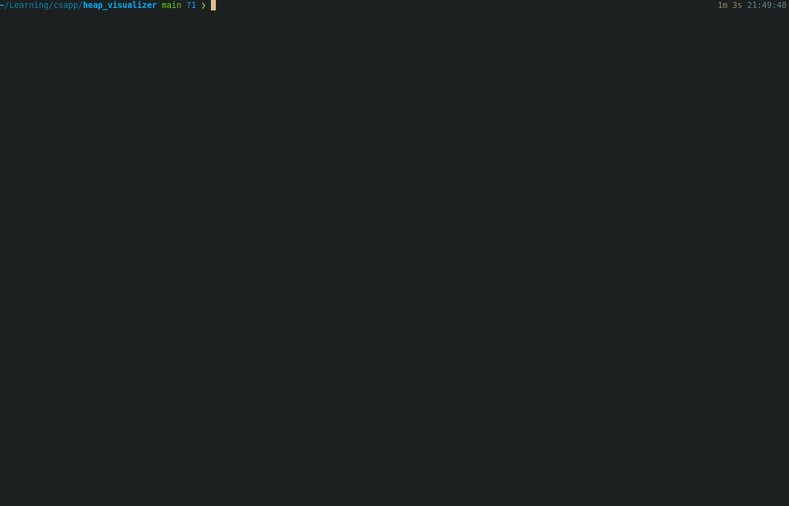

# Description
A small and simple visualizer built on top of the explicit allocator example from [Computer Systems: A Programmer's Perspective](https://csapp.cs.cmu.edu/) (chapter 9 on Virtual Memory).

It allows 2 commands: `malloc <bytes>` and `free <block address>` and displays a representation of the heap and the allocator's implicit free list.
It was meant as a learning project to help me get an intuition for the general job of an explicit allocator such as the malloc package.
One can see heap blocks being allocated, freed and coalesced as well the heap being expanded by requesting the kernel for more memory.

Each block has the following structure: `|header|payload|footer|`. The `payload` is omitted if its size is zero bytes.
The `header` and `footer` carry the same information with the format `size:allocated`. `size` includes the both the `header` and `footer` (4 bytes each). `allocated` is 0 if the block is free or 1 if it is allocated.
Blocks obey an 8-byte alignment. For example, calling `malloc 6` will result in the allocation of a payload of 8 bytes: `|16:1|---8---|16:1|`. If we were to call `free` with the block's address (returned previously by `malloc`), its `allocated` bit would be zeroed (`|16:0|---8---|16:0|`), allowing the block to be allocated again (or coalesced with a neighbouring free block).

The headers and footers allow the allocator to find free blocks without having to do the bookeeping on a dedicated data structure. Thus the name _implicit_ free list.

The heap is initialized with a `prologue` and an `epilogue`. Respectively, `|8:1||8:1|` and `|0:1|` (special case w/ only a header w/ size set to 0).
It is also given a free block with total 4096 bytes (4KB).

NOTE: all code originally from CSAPP except all of `main.c` and functions `mm_read_num_headers`, `mm_read_headers`, `mm_read_size`, `mm_read_alloc` in `mm.c`.

# How to try
Just run the precompiled binary (Linux x86_64 machine) `./heap-visualizer` if you're feeling lucky, or inspect the code and build it yourself.

# Demo

